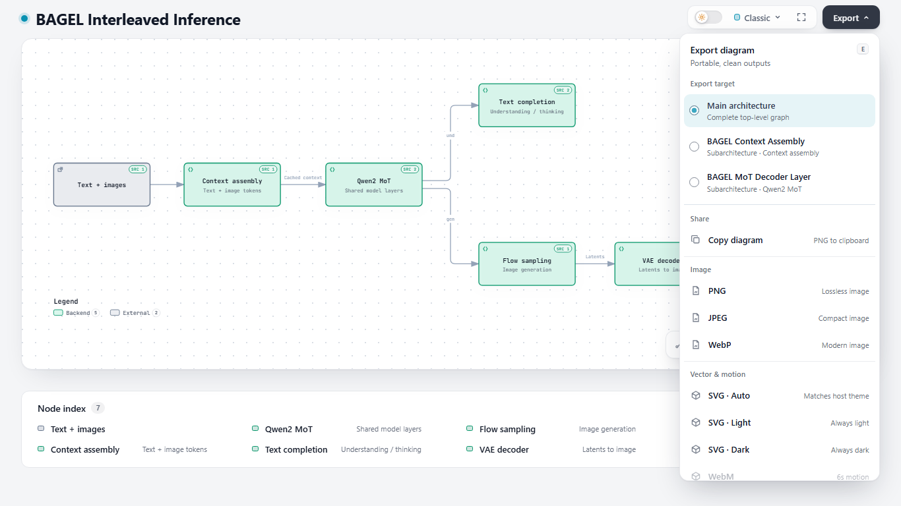

# Export without opening a child

Export lists the main architecture and every authored child by name. Main architecture is selected by default. Each child is identified by its title and owning component. No parent selection or child expansion is required.

The browser proof uses source commit `2b380808737f5582a36b0e4b7d34d150aed07d18` at 1366 × 768. It downloads the three main graphs and all five child SVGs through real anchor clicks. Each file contains exactly its expected components. No child view is mounted, and the parent selection stays empty. [The receipt](receipt.json) records all eight downloads.

Export selection also remains independent of the open view. The regression exports BAGEL Context while the MoT view is open, then closes that view and exports MoT. A separate test downloads both children and a PNG while every child is closed and preserves the selected parent and scroll position.
